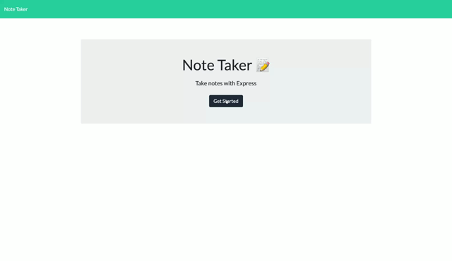

# Note Taker Starter Code

## Badges
  

  ## Table of Contents
  * [License](#license)
  * [Description](#description)
  * [Installation](#installation)
  * [Deployed Link](#deployedlink)
  * [Usage](#usage)
  * [Questions](#questions)

  ## License
  Read more about ISC here:
  [ISC] (https://opensource.org/licenses/ISC)

  ## Description
    Your challenge is to create an application called Note Taker that can be used to write and save notes.
     This application will use an Express.js back end and will save and retrieve note data from a JSON file.

    The application’s front end has already been created. It's your job to build the back end, connect the two, 
    and then deploy the entire application to Heroku.

  ## Installation
  1. Download the starter code from GitHub.
  2. Install dependencies using "npm install" 
  3. Now you are ready to use on Heroku!

  ## Deployed Link

  

  ## Usage
  The Note Taker app is used to write and save notes. When opening the Note Taker app, the user will be presented with a landing page then click on the Get Started button. Enter your note's and text in the designated fields. As you finish writing your note, click the save icon in the nav bar. If you want to delete a note click the red trash can to the right of the saved note.
  

  ## Questions?
  ### Reach me here: 
  [claire-max](https://github.com/claire-max)  
  